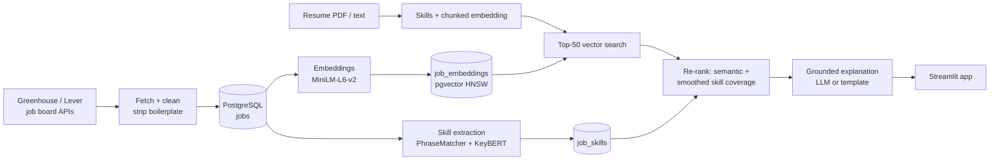

# JobForge AI

Upload a resume and get the job postings that fit it best, with the skills you match, the skills you're
missing, and a short explanation of each match.

Under the hood it's a small retrieval-augmented generation (RAG) system over ~9,800 real postings from
40 companies' public Greenhouse and Lever job boards:

- **Retrieval:** resume and postings are embedded with `all-MiniLM-L6-v2`; PostgreSQL + pgvector (HNSW
  index) returns the 50 most similar postings.
- **Re-ranking:** each candidate is scored on semantic similarity plus *skill coverage*, the share of the
  job's skills found in the resume (spaCy PhraseMatcher over a 298-skill vocabulary with aliases).
- **Explanations:** an LLM (OpenAI or Anthropic via LangChain) explains the top matches using only the
  matched/missing skill lists. Output is checked in code; anything naming an unlisted skill is regenerated
  once, then replaced by a template built from the lists. With no API key, every match uses the template.



## Quickstart (Docker)

Requires Docker Desktop. The first build takes a few minutes (it downloads CPU-only PyTorch and the models).

```bash
git clone https://github.com/aaditya-krishna/jobforge-ai.git
cd jobforge-ai
docker compose up -d --build
```

The database starts empty. Build the index (about 15 minutes for all 40 boards on a laptop CPU):

```bash
docker compose run --rm app python scripts/fetch_jobs.py
docker compose run --rm app python scripts/load_jobs.py
docker compose run --rm app python scripts/extract_skills.py
docker compose run --rm app python scripts/index_jobs.py
```

For a quick try, fetch a single board instead: `python scripts/fetch_jobs.py --only discord`.

Open http://localhost:8501 and upload a resume, or paste its text.

**Optional LLM explanations:** copy `.env.example` to `.env`, set `LLM_PROVIDER` (`openai` or
`anthropic`), `LLM_MODEL`, and the matching API key, then `docker compose up -d` again.

**Ports:** the database is published on `127.0.0.1:5433` and the app on `127.0.0.1:8501`. Override with
`DB_PORT` / `APP_PORT` if those are taken.

## Local development

Python 3.12:

```bash
py -3.12 -m venv .venv
.venv\Scripts\activate
pip install -r requirements.txt
pip install -e .
python -m spacy download en_core_web_sm
copy .env.example .env
docker compose up -d db
python scripts/init_db.py
```

(macOS/Linux: `python3.12 -m venv .venv`, `source .venv/bin/activate`, `cp .env.example .env`.)
Then run the four pipeline scripts above without the `docker compose run --rm app` prefix, and:

```bash
streamlit run app/streamlit_app.py
python scripts/match_resume.py data/eval/resumes/backend_engineer.md
python scripts/search.py "machine learning engineer building recommendation systems"
pytest
```

## Results

From `scripts/evaluate.py` (full output in [`data/eval/results.md`](data/eval/results.md)). 12 synthetic
resumes across 12 role families; for each, every role in its top-50 semantic candidate pool was labeled
relevant or not (518 labels), and each ranking method re-orders that same pool.

| Ranking | Precision@5 | Precision@10 |
|---|---|---|
| semantic only | 0.767 | 0.733 |
| coverage only | 0.633 | 0.717 |
| hybrid w=0.5 | 0.633 | 0.717 |
| hybrid w=0.6 | 0.650 | 0.725 |
| hybrid w=0.7 | 0.700 | 0.750 |
| hybrid w=0.8 | 0.767 | 0.717 |
| hybrid w=0.7, smoothed coverage (prior 3) | 0.783 | 0.800 |
| **hybrid w=0.7, smoothed coverage (prior 5)** (default) | **0.817** | **0.808** |
| hybrid w=0.6, smoothed coverage (prior 5) | 0.783 | 0.800 |
| hybrid w=0.7, + KeyBERT skills | 0.817 | 0.808 |

Share of relevant roles in the candidate pools (any ordering): 0.553.

What this shows, and what it doesn't:

- The guide's plain hybrid (`0.7 · semantic + 0.3 · coverage`) did **not** beat semantic-only at P@5.
  Raw coverage over-rewards jobs with very few extracted skills (1 of 1 = 100%).
- Smoothing coverage as `matched / (job skills + 5)` fixes that and gave the best scores. Adding KeyBERT
  phrases to coverage scores identically, because it mostly adds ~5 unmatched phrases to every job: the
  same smoothing effect, not better skills.
- **Caveats:** the resumes are synthetic, and the relevance labels were assigned by Claude (the AI
  assistant that built this project) using written criteria in
  [`data/eval/LABELING.md`](data/eval/LABELING.md); no person has reviewed them yet. The default weights
  were chosen on this same set, with no held-out data. The gap over semantic-only at P@5 is 3 more
  relevant results out of 60. Treat the table as evidence about relative design choices, not as a
  production accuracy figure.

**Explanation grounding:** 50 of 50 sampled template explanations name only skills from the provided
lists. LLM explanations have not been measured, because no API key was configured.

## Project layout

```
data/companies.csv     job boards to fetch          data/skills.csv     skill vocabulary + aliases
data/eval/             synthetic resumes, labels, labeling guide, results
sql/schema.sql         jobs, job_skills, job_embeddings, explanations
src/jobforge/          ingest/, clean, skills, embed, match, explain, resume, evaluation
scripts/               fetch_jobs, load_jobs, extract_skills, index_jobs, search, match_resume,
                       eval_pool, evaluate, init_db
app/streamlit_app.py   UI
tests/                 pytest (parsers, cleaning, skills, scoring, explanations, app)
```

Design decisions and the reasoning behind them are logged in [`DECISIONS.md`](DECISIONS.md).

## Known limitations

- Long job descriptions are truncated by the embedding model's input limit. Postings have a median of
  ~880 words and all-MiniLM-L6-v2 reads about the first 200. Boilerplate removal cuts the median to
  ~560 words, but most postings are still truncated.
- `load_jobs.py` uses `ON CONFLICT DO NOTHING`, so edits to an already-loaded posting are not picked up,
  and postings removed from a board are never deleted.
- About half of the postings are non-technical (sales, recruiting, ops), which the tech-focused skills
  vocabulary covers poorly.
- Seniority isn't modeled: intern and staff postings for the same role family can rank side by side.
- Coverage is noisy for jobs with only a few extracted skills; the score smooths it (prior 5), but the
  displayed coverage is the raw share.
- Explanations have only been tested with a fake LLM; no live LLM run has been done.
- `posted_at` is the board's first-published date; some evergreen postings date back years.
- The skills vocabulary is hand-built and focused on tech roles.
- The evaluation set is small (12 synthetic resumes), labeled by Claude rather than a person, and the
  weights were tuned on the same set they're reported on.

## Data sources

Postings come from the public job board APIs of Greenhouse
(`boards-api.greenhouse.io`) and Lever (`api.lever.co`), which companies use to publish their openings.
Raw data is not committed; `scripts/fetch_jobs.py` re-downloads it.
